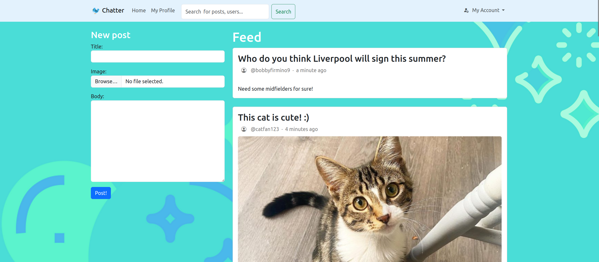
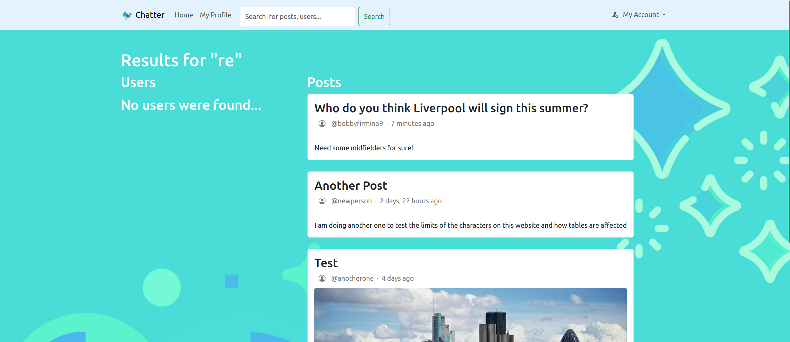
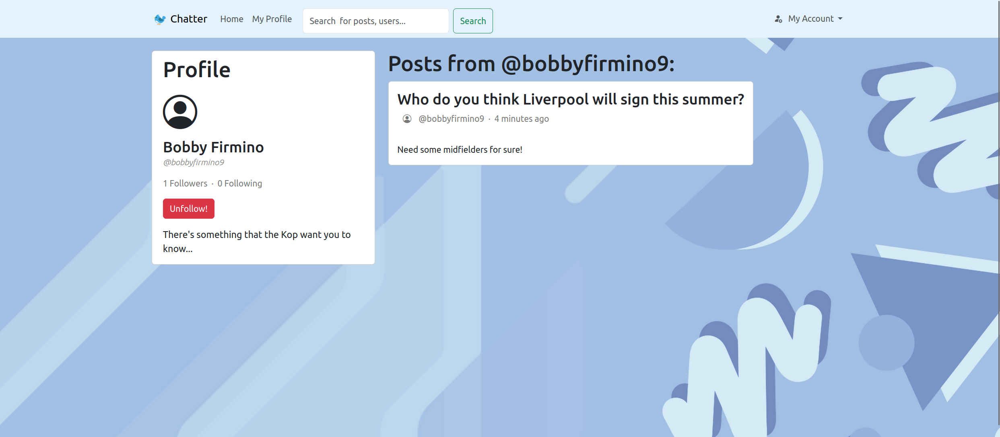

# Chatter
A basic social media platform built with Django.

Users can sign up, login and create posts with text and images.








## Installation instructions
To install the software and use it in your local development environment, you must first set up and activate a local development environment.  From the root of the project:

```
virtualenv venv
source venv/bin/activate
```

Install all required packages:

```
pip3 install -r requirements.txt
```

At the root of the project, create the media directory: ``` /media/post_images ```

Migrate the database:

```
python3 manage.py migrate
```

Run all tests with:
```
python3 manage.py test
```

## Sources
The packages used by this application are specified in `requirements.txt`

This project uses code from a Django project that was part of one of my university modules

Chatter logo is an icon from EmojiOne (now JoyPixels)
